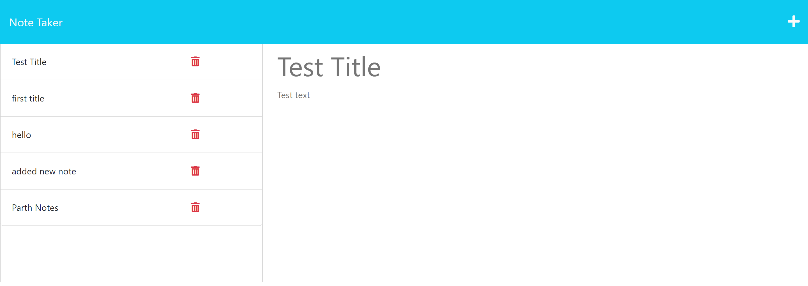

# Parth-Note-Taker 

## Description

The Note taker application is created for an individual to create, write, delete and save there notes. This application was build using Express.js for the backend functioning and to save it will be using data as an JSON file.

## Table of contents

- [Installation](#installation)
- [Usage](#usage)
- [Screenshot](#screenshot)
- [Contribution](#contribution)
- [Questions](#questions)
- [License](#license)

## Installation

For installation, clone the GitHub repository [Parth-Note-Taker](https://github.com/Parth0415/Parth-Note-Taker).
Then go to the file location, open file with the help of terminal:

 To install dependencies, run the following command:
```
npm i
```
 
 After that run the following command:
```
node server.js
```

## Usage

- To start using the application make sure you deployed that application on live URL.
- Once you deployed the app click on "Get Started Button".
- If you want to create a new note then click on "+" icon located on top-right side of the app.
- Then it will allow you to edit your Note title and Note text. 
- Once you finish updating the note, it will showcase you the "Save" icon to save the notes.
- Once you will press save icon your edited notes will move on left-hand column with other existing notes.
-Each notes will have an delete icon attached to it. If you want to delete notes click the delete icon of the specific notes which you want to delete.


## Screenshot




## Contribution

This application was created by Parth Mali. If any questions please feel free to contact me by email .

## Questions

My Email:
[parthmali1597@gmail.com](mailto:parthmali1597@gmail.com)

Github:
[Parth0415](https://github.com/Parth0415)

## License

MIT